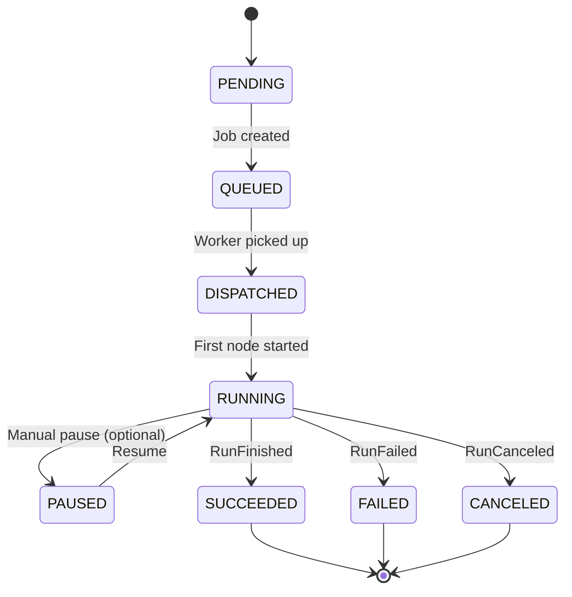
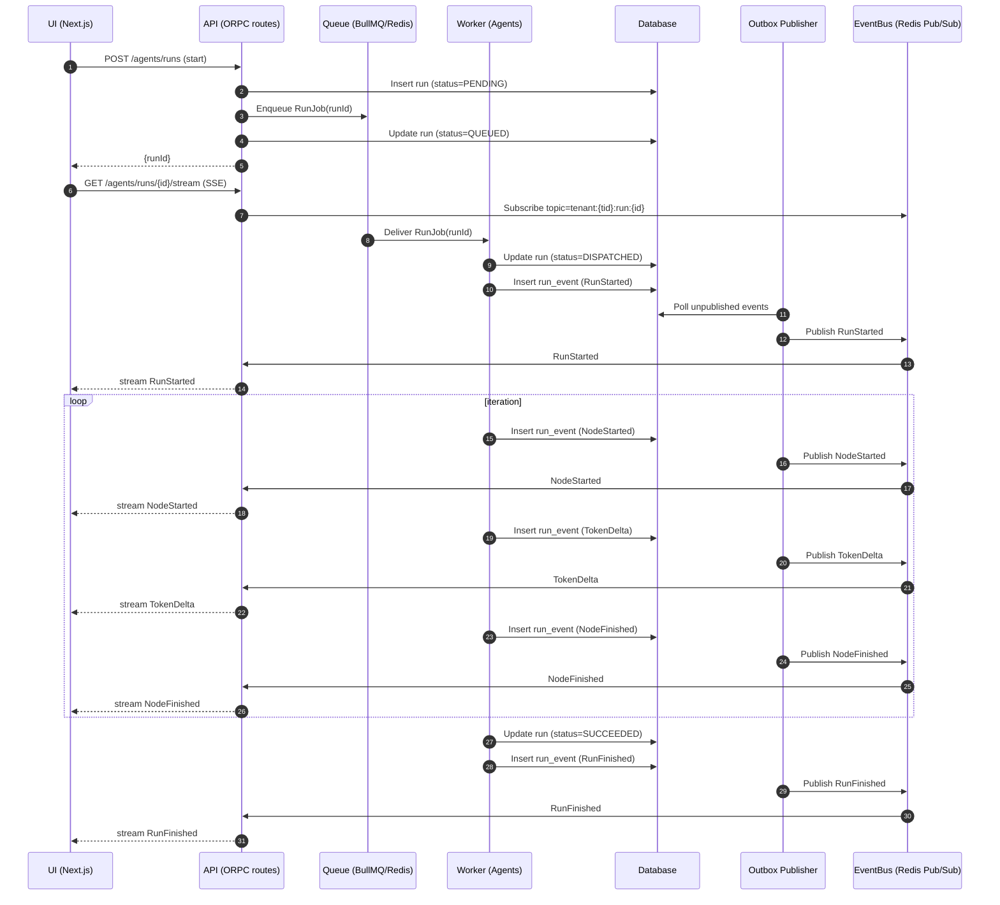
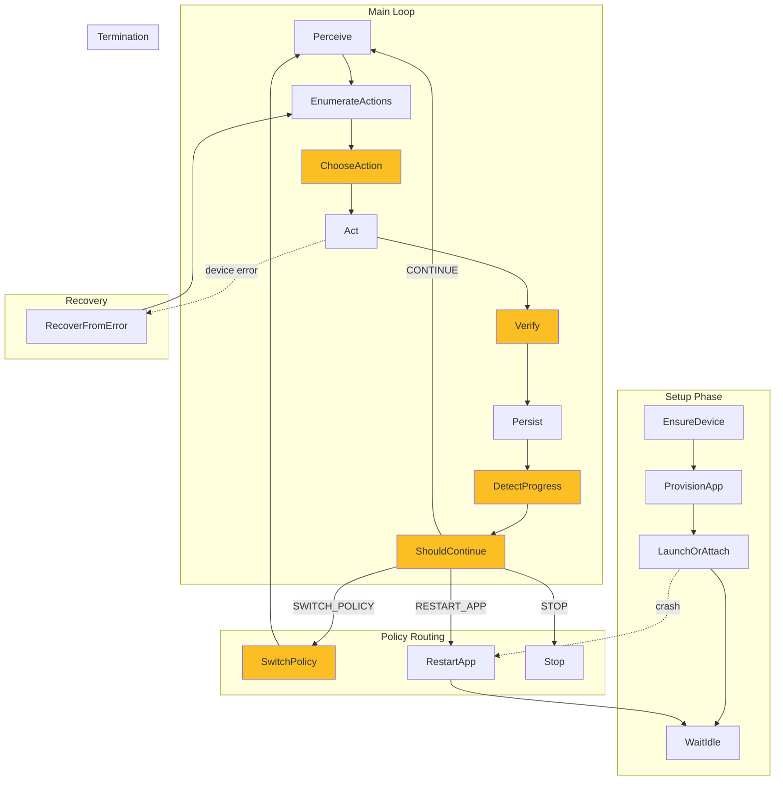

# Agent System — Deep Architecture Review

**Status:** Living Document  
**Last Updated:** 2025-10-12  
**Purpose:** Package-level flows, event topology, delivery semantics, and production-readiness guidance

---

## Table of Contents

1. [Executive Summary](#executive-summary)
2. [Event Streams — Wire-Level Contracts](#event-streams)
3. [Data Flow — Write Path Discipline](#data-flow)
4. [Package Boundaries & Dependencies](#package-boundaries)
5. [Run State Machine](#run-state-machine)
6. [LangGraph Node Contracts](#langgraph-nodes)
7. [Observability & Operations](#observability)
8. [Multi-Tenancy & Auth](#multi-tenancy)
9. [API Surface Specification](#api-surface)
10. [Queue Details (BullMQ)](#queue-details)
11. [UI Event Handling](#ui-event-handling)
12. [Thin Useful Path (MVP)](#thin-useful-path)

---

## Executive Summary

### What's Great

- **Clear event topology:** UI ⇄ API ⇄ Queue ⇄ Worker with dedicated event bus for streaming
- **Contracts package** (`agents-contracts`) as single source of truth for enums/zod schemas
- **Pure, stateless nodes** with domain events — excellent for determinism and testing
- **Separation of concerns:** transport (BullMQ/Redis) vs domain (orchestrator + nodes)

### Key Refinements Needed

1. At-least-once delivery semantics with idempotency keys
2. SSE reconnect with backfill support
3. Outbox pattern for event persistence and replay
4. Strict package boundaries enforced via ESLint
5. Expanded state machine with transient states
6. Multi-tenant topic scoping
7. OpenTelemetry tracing and metrics

---

## Event Streams

### Delivery Semantics

**Reality:** Redis Pub/Sub and BullMQ are **at-least-once**. Design for idempotency.

### Event Base Schema

```typescript
// packages/agents-contracts/src/events/base.ts
import { z } from 'zod';

export const EventBase = z.object({
  eventId: z.string().ulid(),        // Unique per event
  runId: z.string().ulid(),          // Aggregation root
  sequence: z.number().int().nonnegative(), // Monotonic per run
  ts: z.string().datetime(),         // ISO 8601
  kind: z.string(),                  // Event discriminator
  version: z.literal('1'),           // Schema version
  tenantId: z.string().ulid(),       // Multi-tenant isolation
});

export type EventBase = z.infer<typeof EventBase>;
```

### Concrete Event Examples

```typescript
// packages/agents-contracts/src/events/run.ts
export const RunStarted = EventBase.extend({
  kind: z.literal('RunStarted'),
  appId: z.string(),
  policy: z.string(),
});

export const RunFinished = EventBase.extend({
  kind: z.literal('RunFinished'),
  summary: z.string(),
  stepsCompleted: z.number().int(),
});

export const RunFailed = EventBase.extend({
  kind: z.literal('RunFailed'),
  reason: z.string(),
  errorCode: z.string(),
});

export const RunCanceled = EventBase.extend({
  kind: z.literal('RunCanceled'),
  canceledBy: z.string().optional(),
});

// packages/agents-contracts/src/events/node.ts
export const NodeStarted = EventBase.extend({
  kind: z.literal('NodeStarted'),
  node: z.string(),
  iteration: z.number().int(),
});

export const TokenDelta = EventBase.extend({
  kind: z.literal('TokenDelta'),
  node: z.string(),
  text: z.string().min(1),
});

export const NodeFinished = EventBase.extend({
  kind: z.literal('NodeFinished'),
  node: z.string(),
  result: z.enum(['SUCCESS', 'FAILURE', 'SKIPPED']),
  durationMs: z.number(),
});

export const PolicySwitched = EventBase.extend({
  kind: z.literal('PolicySwitched'),
  fromPolicy: z.string(),
  toPolicy: z.string(),
  reason: z.string(),
});
```

### SSE Reconnect Protocol

**API Requirement:** Accept `?fromSeq=<n>` to backfill after disconnect.

```typescript
// packages/api/modules/agents/procedures/stream-run.ts
export const streamRun = protectedProcedure
  .route({
    method: 'GET',
    path: '/agents/runs/{runId}/stream',
  })
  .input(
    type<{
      runId: string;
      fromSeq?: number; // Backfill from this sequence
    }>(),
  )
  .handler(async ({ input, context }) => {
    const { runId, fromSeq = 0 } = input;
    
    // Verify access
    await verifyRunAccess(runId, context.user.id);
    
    // Backfill missed events from DB
    const missedEvents = await getRunEvents({
      runId,
      sequenceGte: fromSeq,
    });
    
    // Subscribe to live topic
    const topic = `tenant:${context.tenantId}:run:${runId}`;
    
    return streamToEventIterator(
      mergeStreams(
        streamFromArray(missedEvents),
        eventBus.subscribe(topic),
      ),
    );
  });
```

**UI Pattern:** Keep `highestSequenceSeen`; ignore duplicates.

```typescript
// apps/web/modules/saas/agents/hooks/useRunStream.ts
function useRunStream(runId: string) {
  const [events, setEvents] = useState<AgentEvent[]>([]);
  const highestSeqRef = useRef(0);
  
  useEffect(() => {
    const stream = fetch(
      `/api/agents/runs/${runId}/stream?fromSeq=${highestSeqRef.current}`,
    );
    
    stream.onMessage((event) => {
      if (event.sequence <= highestSeqRef.current) {
        return; // Duplicate; ignore
      }
      highestSeqRef.current = event.sequence;
      setEvents((prev) => [...prev, event]);
    });
  }, [runId]);
  
  return events;
}
```

### Cancellation Semantics

**Not** just a queue operation. It's a **state machine transition**.

1. API sets `run.status = CANCELED_REQUESTED` (DB)
2. Worker checks before each node: `if (state.cancelRequested) { emit(RunCanceled); break; }`
3. Worker emits exactly one terminal event: `RunCanceled`
4. API guarantees exactly one of: `RunFinished | RunFailed | RunCanceled`

**Implementation (worker):**

```typescript
// packages/agents/src/orchestrator/runner.ts
async function executeRun(runId: string) {
  let state = await loadRunState(runId);
  
  while (!state.done) {
    // Check cancellation before each step
    const run = await db.run.findUnique({ where: { id: runId } });
    if (run.status === 'CANCELED_REQUESTED') {
      await emitEvent({ kind: 'RunCanceled', runId });
      await db.run.update({
        where: { id: runId },
        data: { status: 'CANCELED', finishedAt: new Date() },
      });
      return;
    }
    
    state = await executeNextNode(state);
  }
  
  await emitTerminalEvent(state);
}
```

---

## Data Flow

### Single Writer Rule

**Problem:** Multiple nodes writing to `runs` table = race conditions.

**Solution:** Orchestrator is the **only** writer of `runs` and `steps` tables.

- Nodes write artifacts via ports (repo interfaces)
- Nodes emit events; orchestrator persists them

### Outbox Pattern

**Persist events to DB before publishing** to Redis Pub/Sub.

```sql
-- packages/database/prisma/schema.prisma
model RunEvent {
  id            String   @id @default(cuid())
  runId         String
  sequence      Int
  eventId       String   @unique
  kind          String
  payload       Json
  publishedAt   DateTime?
  failedAt      DateTime?
  createdAt     DateTime @default(now())
  
  run           Run      @relation(fields: [runId], references: [id])
  
  @@unique([runId, sequence])
  @@index([runId, publishedAt])
}
```

**Outbox Publisher (separate worker):**

```typescript
// packages/queue/src/workers/outbox-publisher.ts
import { eventBus } from '@repo/eventbus';
import { db } from '@repo/database';

async function publishPendingEvents() {
  const pending = await db.runEvent.findMany({
    where: { publishedAt: null, failedAt: null },
    orderBy: [{ runId: 'asc' }, { sequence: 'asc' }],
    take: 100,
  });
  
  for (const event of pending) {
    try {
      const topic = `tenant:${event.tenantId}:run:${event.runId}`;
      await eventBus.publish(topic, event.payload);
      
      await db.runEvent.update({
        where: { id: event.id },
        data: { publishedAt: new Date() },
      });
    } catch (err) {
      await db.runEvent.update({
        where: { id: event.id },
        data: { failedAt: new Date() },
      });
    }
  }
}

// Run every 100ms
setInterval(publishPendingEvents, 100);
```

**Benefits:**

- Replay capability (backfill from DB)
- Eventual Kafka/NATS upgrade path
- Guaranteed delivery ordering per run

### Backpressure

**Problem:** `TokenDelta` events can flood the UI (1 event per token).

**Solution:** Coalesce client-side every 50–100ms.

```typescript
// apps/web/modules/saas/agents/hooks/useRunStream.ts
function coalesceTokenDeltas(events: AgentEvent[]): AgentEvent[] {
  const coalesced: AgentEvent[] = [];
  let buffer: TokenDelta[] = [];
  
  for (const event of events) {
    if (event.kind === 'TokenDelta') {
      buffer.push(event);
    } else {
      if (buffer.length) {
        coalesced.push(mergeTokenDeltas(buffer));
        buffer = [];
      }
      coalesced.push(event);
    }
  }
  
  return coalesced;
}
```

---

## Package Boundaries

### Dependency Rules (enforced via ESLint)

```json
// .eslintrc.json
{
  "extends": ["@repo/eslint-config"],
  "plugins": ["boundaries"],
  "settings": {
    "boundaries/elements": [
      { "type": "apps", "pattern": "apps/*" },
      { "type": "api", "pattern": "packages/api" },
      { "type": "agents", "pattern": "packages/agents" },
      { "type": "contracts", "pattern": "packages/agents-contracts" },
      { "type": "infra", "pattern": "packages/{queue,eventbus,eventbus-*,queue-*}" },
      { "type": "shared", "pattern": "packages/{ai,database,logs,utils}" }
    ],
    "boundaries/rules": [
      {
        "from": ["apps"],
        "allow": ["api", "shared"]
      },
      {
        "from": ["api"],
        "allow": ["contracts", "infra", "shared"]
      },
      {
        "from": ["agents"],
        "allow": ["contracts", "shared"],
        "disallow": ["infra"] // Agents use ports, not concrete impls
      },
      {
        "from": ["infra"],
        "allow": ["shared"]
      },
      {
        "from": ["shared"],
        "allow": []
      }
    ]
  }
}
```

### Package Structure

```
packages/
├── agents/              # Orchestrator, nodes, ports (domain)
│   ├── src/
│   │   ├── orchestrator/
│   │   ├── nodes/
│   │   ├── ports/       # Interfaces only
│   │   └── services/
│   └── package.json
│
├── agents-contracts/    # Enums, constants, zod schemas
│   ├── src/
│   │   ├── events/
│   │   ├── dtos/
│   │   └── constants/
│   └── package.json
│
├── eventbus/            # Interface
│   ├── src/
│   │   └── port.ts
│   └── package.json
│
├── eventbus-redis/      # Redis Pub/Sub adapter
│   ├── src/
│   │   └── redis-adapter.ts
│   └── package.json
│
├── queue/               # Interface
│   └── src/
│       └── port.ts
│
├── queue-bullmq/        # BullMQ adapter
│   └── src/
│       └── bullmq-adapter.ts
│
└── api/                 # Routes, streaming, auth
    └── modules/
        └── agents/
```

### Hexagonal Ports Example

```typescript
// packages/agents/src/ports/llm-port.ts
export interface LLMPort {
  complete(prompt: string, options: LLMOptions): Promise<string>;
  stream(prompt: string, options: LLMOptions): AsyncIterable<string>;
}

// packages/ai/src/adapters/openai-llm-adapter.ts
import { LLMPort } from '@repo/agents/ports';
import OpenAI from 'openai';

export class OpenAILLMAdapter implements LLMPort {
  constructor(private client: OpenAI) {}
  
  async complete(prompt: string, options: LLMOptions): Promise<string> {
    const response = await this.client.chat.completions.create({
      model: options.model,
      messages: [{ role: 'user', content: prompt }],
    });
    return response.choices[0].message.content;
  }
  
  async *stream(prompt: string, options: LLMOptions) {
    const stream = await this.client.chat.completions.create({
      model: options.model,
      messages: [{ role: 'user', content: prompt }],
      stream: true,
    });
    
    for await (const chunk of stream) {
      yield chunk.choices[0]?.delta?.content || '';
    }
  }
}
```

---

## Run State Machine

### Expanded States



### State Definitions

| State | Description | Transitions |
|-------|-------------|-------------|
| `PENDING` | Run created, not yet queued | → `QUEUED` |
| `QUEUED` | Job persisted in BullMQ | → `DISPATCHED` |
| `DISPATCHED` | Worker received job | → `RUNNING` |
| `RUNNING` | Orchestrator executing nodes | → `PAUSED`, `SUCCEEDED`, `FAILED`, `CANCELED` |
| `PAUSED` | Manual pause (rate limits) | → `RUNNING` |
| `SUCCEEDED` | Terminal: completed successfully | (none) |
| `FAILED` | Terminal: unrecoverable error | (none) |
| `CANCELED` | Terminal: user/system canceled | (none) |

### Compare-and-Swap Terminal Transition

**Problem:** Prevent double-emit of terminal events.

**Solution:** DB-level CAS on status transition.

```typescript
// packages/agents/src/orchestrator/runner.ts
async function transitionToTerminal(
  runId: string,
  status: 'SUCCEEDED' | 'FAILED' | 'CANCELED',
  event: AgentEvent,
) {
  const updated = await db.run.updateMany({
    where: {
      id: runId,
      status: { in: ['RUNNING', 'DISPATCHED'] }, // Only if not already terminal
    },
    data: {
      status,
      finishedAt: new Date(),
    },
  });
  
  if (updated.count === 0) {
    // Already transitioned by another process; skip event
    return;
  }
  
  await persistEvent(runId, event);
}
```

---

## LangGraph Nodes

### Node I/O Contract

Every node must define:

```typescript
// packages/agents-contracts/src/node-contract.ts
export interface NodeContract<TInput, TOutput> {
  name: string;
  inputSchema: z.ZodType<TInput>;
  outputSchema: z.ZodType<TOutput>;
  ports: string[]; // e.g., ['llm', 'driver', 'telemetry']
  emittedEvents: string[]; // e.g., ['NodeStarted', 'TokenDelta', 'NodeFinished']
}
```

### Example Node Implementation

```typescript
// packages/agents/src/nodes/choose-action.ts
import { NodeContract } from '@repo/agents-contracts';
import { LLMPort } from '../ports/llm-port';
import { TelemetryPort } from '../ports/telemetry-port';

export const ChooseActionContract: NodeContract<
  ChooseActionInput,
  ChooseActionOutput
> = {
  name: 'ChooseAction',
  inputSchema: z.object({
    availableActions: z.array(z.string()),
    context: z.string(),
  }),
  outputSchema: z.object({
    selectedAction: z.string(),
    reasoning: z.string(),
  }),
  ports: ['llm', 'telemetry'],
  emittedEvents: ['NodeStarted', 'TokenDelta', 'NodeFinished'],
};

export class ChooseActionNode {
  constructor(
    private llm: LLMPort,
    private telemetry: TelemetryPort,
  ) {}
  
  async run(state: AgentState): Promise<AgentState> {
    await this.telemetry.emit({ kind: 'NodeStarted', node: 'ChooseAction' });
    
    const prompt = buildPrompt(state);
    let reasoning = '';
    
    for await (const token of this.llm.stream(prompt)) {
      reasoning += token;
      await this.telemetry.emit({ kind: 'TokenDelta', node: 'ChooseAction', text: token });
    }
    
    const selectedAction = parseAction(reasoning);
    
    await this.telemetry.emit({
      kind: 'NodeFinished',
      node: 'ChooseAction',
      result: 'SUCCESS',
    });
    
    return {
      ...state,
      selectedAction,
      reasoning,
    };
  }
}
```

### Recovery: Resume Tokens

**Goal:** Crash recovery without re-executing expensive operations.

```typescript
// packages/agents/src/orchestrator/checkpoint.ts
interface Checkpoint {
  runId: string;
  iteration: number;
  node: string;
  resumeToken: string; // Opaque string (JSON-encoded state snapshot)
  createdAt: Date;
}

async function saveCheckpoint(state: AgentState) {
  await db.checkpoint.create({
    data: {
      runId: state.runId,
      iteration: state.iteration,
      node: state.currentNode,
      resumeToken: JSON.stringify(state),
    },
  });
}

async function resumeFromCheckpoint(runId: string): Promise<AgentState | null> {
  const checkpoint = await db.checkpoint.findFirst({
    where: { runId },
    orderBy: { createdAt: 'desc' },
  });
  
  if (!checkpoint) return null;
  
  return JSON.parse(checkpoint.resumeToken);
}
```

---

## Observability

### OpenTelemetry Tracing

**Root span per run; child spans per node.**

```typescript
// packages/agents/src/orchestrator/runner.ts
import { trace } from '@opentelemetry/api';

const tracer = trace.getTracer('agent-orchestrator');

async function executeRun(runId: string) {
  return tracer.startActiveSpan(`run:${runId}`, async (span) => {
    span.setAttribute('run.id', runId);
    span.setAttribute('run.tenant_id', tenantId);
    
    let state = await loadRunState(runId);
    
    while (!state.done) {
      await executeNodeWithSpan(state);
      state = await getNextState(state);
    }
    
    span.setStatus({ code: SpanStatusCode.OK });
    span.end();
  });
}

async function executeNodeWithSpan(state: AgentState) {
  return tracer.startActiveSpan(`node:${state.currentNode}`, async (span) => {
    span.setAttribute('node.name', state.currentNode);
    span.setAttribute('node.iteration', state.iteration);
    span.setAttribute('run.policy', state.policy);
    
    const result = await executeNode(state);
    
    span.setAttribute('node.result', result.status);
    span.end();
    
    return result;
  });
}
```

### Metrics

```typescript
// packages/logs/src/metrics.ts
import { Counter, Histogram, Gauge } from 'prom-client';

export const runsStartedTotal = new Counter({
  name: 'agent_runs_started_total',
  help: 'Total runs started',
  labelNames: ['tenant_id', 'app_id'],
});

export const runsCompletedTotal = new Counter({
  name: 'agent_runs_completed_total',
  help: 'Total runs completed',
  labelNames: ['tenant_id', 'status'], // SUCCEEDED, FAILED, CANCELED
});

export const runDuration = new Histogram({
  name: 'agent_run_duration_seconds',
  help: 'Run duration in seconds',
  labelNames: ['tenant_id', 'status'],
  buckets: [1, 5, 10, 30, 60, 120, 300, 600],
});

export const nodeDuration = new Histogram({
  name: 'agent_node_duration_seconds',
  help: 'Node execution duration',
  labelNames: ['node'],
  buckets: [0.1, 0.5, 1, 2, 5, 10],
});

export const tokenDeltaRate = new Gauge({
  name: 'agent_token_delta_rate',
  help: 'Token delta events per second',
  labelNames: ['node'],
});
```

### Dead Letter Queues

**BullMQ:**

```typescript
// packages/queue-bullmq/src/setup.ts
import { Queue, Worker } from 'bullmq';

const runQueue = new Queue('agent-runs', {
  connection: redis,
  defaultJobOptions: {
    attempts: 3,
    backoff: { type: 'exponential', delay: 2000 },
    removeOnComplete: 100,
    removeOnFail: false, // Keep failed jobs for inspection
  },
});

const runWorker = new Worker('agent-runs', async (job) => {
  await executeRun(job.data.runId);
}, {
  connection: redis,
  concurrency: 5,
});

// Dead-letter queue for permanently failed jobs
runWorker.on('failed', async (job, err) => {
  if (job.attemptsMade >= 3) {
    await db.runEvent.create({
      data: {
        runId: job.data.runId,
        kind: 'RunFailed',
        payload: { reason: err.message, errorCode: 'MAX_RETRIES_EXCEEDED' },
      },
    });
  }
});
```

**Event Bus:**

```typescript
// packages/queue/src/workers/outbox-publisher.ts
async function publishPendingEvents() {
  const pending = await db.runEvent.findMany({
    where: { publishedAt: null, failedAt: null },
    orderBy: [{ runId: 'asc' }, { sequence: 'asc' }],
    take: 100,
  });
  
  for (const event of pending) {
    try {
      await eventBus.publish(topic, event.payload);
      await db.runEvent.update({
        where: { id: event.id },
        data: { publishedAt: new Date() },
      });
    } catch (err) {
      // Mark failed; retry later
      await db.runEvent.update({
        where: { id: event.id },
        data: { failedAt: new Date() },
      });
    }
  }
  
  // Retry failed events (exponential backoff)
  const failed = await db.runEvent.findMany({
    where: {
      failedAt: { not: null },
      failedAt: { lt: new Date(Date.now() - 60_000) }, // Retry after 1 min
    },
    take: 10,
  });
  
  for (const event of failed) {
    try {
      await eventBus.publish(topic, event.payload);
      await db.runEvent.update({
        where: { id: event.id },
        data: { publishedAt: new Date(), failedAt: null },
      });
    } catch {
      // Still failing; leave for next retry
    }
  }
}
```

---

## Multi-Tenancy

### Row-Level Security

**All rows must include:**

```typescript
interface TenantScoped {
  tenantId: string;
  projectId?: string;
}
```

**Prisma schema:**

```prisma
model Run {
  id          String   @id @default(cuid())
  tenantId    String
  projectId   String?
  userId      String
  status      String
  // ...
  
  @@index([tenantId, status])
  @@index([userId, status])
}

model RunEvent {
  id          String   @id @default(cuid())
  runId       String
  tenantId    String   // Denormalized for query perf
  sequence    Int
  // ...
  
  @@unique([runId, sequence])
  @@index([tenantId, runId])
}
```

**If using Supabase:** enable RLS policies.

```sql
-- Enable RLS on runs table
ALTER TABLE runs ENABLE ROW LEVEL SECURITY;

CREATE POLICY "Users can only access their tenant's runs"
  ON runs
  FOR ALL
  USING (tenant_id = current_setting('app.current_tenant_id')::text);
```

### Event Topic Scoping

**Topic format:** `tenant:{tenantId}:run:{runId}`

```typescript
// packages/api/modules/agents/procedures/stream-run.ts
export const streamRun = protectedProcedure
  .handler(async ({ input, context }) => {
    const { runId } = input;
    const tenantId = context.user.tenantId;
    
    // Verify run belongs to tenant
    const run = await db.run.findUnique({
      where: { id: runId, tenantId },
    });
    
    if (!run) throw new ORPCError('NOT_FOUND');
    
    // Subscribe to tenant-scoped topic
    const topic = `tenant:${tenantId}:run:${runId}`;
    return eventBus.subscribe(topic);
  });
```

**Benefits:**

- Prevents cross-tenant event leaks
- Enables per-tenant rate limiting
- Simplifies audit logs

### SSE Auth

**Short-lived bearer tokens:**

```typescript
// apps/web/modules/saas/agents/hooks/useRunStream.ts
function useRunStream(runId: string) {
  const { session } = useAuth();
  
  useEffect(() => {
    const eventSource = new EventSource(
      `/api/agents/runs/${runId}/stream`,
      {
        withCredentials: true,
        headers: {
          Authorization: `Bearer ${session.accessToken}`,
        },
      },
    );
    
    eventSource.onmessage = (event) => {
      const parsed = JSON.parse(event.data);
      handleEvent(parsed);
    };
    
    return () => eventSource.close();
  }, [runId, session]);
}
```

---

## API Surface

### POST /agents/runs

**Create a new agent run.**

```typescript
// Request
{
  "appId": "com.example.app",
  "policy": "exploratory",
  "seedState": { /* optional initial state */ }
}

// Response
{
  "runId": "01HQZX7J8K9M2N3P4Q5R6S7T8U"
}
```

### GET /agents/runs/:id

**Get run metadata.**

```typescript
// Response
{
  "id": "01HQZX7J8K9M2N3P4Q5R6S7T8U",
  "status": "RUNNING",
  "progress": 0.42,
  "startedAt": "2025-10-12T10:00:00Z",
  "finishedAt": null,
  "policy": "exploratory",
  "policyVersion": 2,
  "stepsCompleted": 12
}
```

### GET /agents/runs/:id/stream

**Stream events (SSE).**

```
GET /agents/runs/:id/stream?fromSeq=0

200 OK
Content-Type: text/event-stream

id: 0
data: {"kind":"RunStarted","runId":"..."}

id: 1
data: {"kind":"NodeStarted","node":"Perceive"}

id: 2
data: {"kind":"TokenDelta","text":"Analyzing"}
```

### POST /agents/runs/:id/cancel

**Request cancellation.**

```typescript
// Response
{
  "status": "CANCELED_REQUESTED"
}
```

### POST /agents/runs/:id/pause

**(Optional) Pause execution.**

```typescript
// Response
{
  "status": "PAUSED"
}
```

### POST /agents/runs/:id/resume

**(Optional) Resume from pause.**

```typescript
// Response
{
  "status": "RUNNING"
}
```

### GET /agents/runs/:id/events

**Backfill events (for clients that can't hold SSE).**

```typescript
// Request
GET /agents/runs/:id/events?fromSeq=10&limit=100

// Response
{
  "events": [
    { "sequence": 10, "kind": "NodeFinished", ... },
    { "sequence": 11, "kind": "NodeStarted", ... }
  ],
  "hasMore": true
}
```

---

## Queue Details

### BullMQ Configuration

```typescript
// packages/queue-bullmq/src/setup.ts
import { Queue, Worker, QueueScheduler } from 'bullmq';
import IORedis from 'ioredis';

const redis = new IORedis(process.env.REDIS_URL);

export const runQueue = new Queue('agent-runs', {
  connection: redis,
  defaultJobOptions: {
    removeOnComplete: 100,   // Keep last 100 successful jobs
    attempts: 3,
    backoff: {
      type: 'exponential',
      delay: 2000,
    },
  },
});

// Named jobs for easy cancellation
export async function enqueueRun(runId: string, data: RunJobData) {
  await runQueue.add(`run:${runId}`, data, {
    jobId: `run:${runId}`, // Named job ID
  });
}

// Cancel a queued run
export async function cancelRun(runId: string) {
  const job = await runQueue.getJob(`run:${runId}`);
  if (job && (await job.getState()) === 'waiting') {
    await job.remove();
  }
}
```

### Worker Concurrency

**Per-tenant concurrency limits:**

```typescript
// packages/queue-bullmq/src/workers/run-worker.ts
import { Worker } from 'bullmq';

const runWorker = new Worker(
  'agent-runs',
  async (job) => {
    const { runId } = job.data;
    await executeRun(runId);
  },
  {
    connection: redis,
    concurrency: 10, // Global concurrency
    limiter: {
      max: 2,        // Max 2 jobs per tenant
      duration: 1000, // per second
      groupKey: 'tenantId', // Group by tenant
    },
  },
);
```

---

## UI Event Handling

### Timeline Rendering

```typescript
// apps/web/modules/saas/agents/components/RunTimeline.tsx
export function RunTimeline({ runId }: { runId: string }) {
  const events = useRunStream(runId);
  
  return (
    <div className="timeline">
      {events.map((event) => (
        <TimelineItem key={event.eventId} event={event} />
      ))}
    </div>
  );
}

function TimelineItem({ event }: { event: AgentEvent }) {
  switch (event.kind) {
    case 'RunStarted':
      return <div className="timeline-item success">Run started</div>;
    case 'NodeStarted':
      return <div className="timeline-item">Node: {event.node}</div>;
    case 'NodeFinished':
      return <div className="timeline-item success">Node completed</div>;
    case 'RunFinished':
      return <div className="timeline-item success">Run finished</div>;
    default:
      return null;
  }
}
```

### Gap Detection and Backfill

```typescript
// apps/web/modules/saas/agents/hooks/useRunStream.ts
function useRunStream(runId: string) {
  const [events, setEvents] = useState<AgentEvent[]>([]);
  const expectedSeqRef = useRef(0);
  
  const handleEvent = useCallback(async (event: AgentEvent) => {
    // Gap detected?
    if (event.sequence > expectedSeqRef.current) {
      const missing = await fetch(
        `/api/agents/runs/${runId}/events?fromSeq=${expectedSeqRef.current}&limit=100`,
      ).then((r) => r.json());
      
      setEvents((prev) => [...prev, ...missing.events]);
    }
    
    if (event.sequence >= expectedSeqRef.current) {
      setEvents((prev) => [...prev, event]);
      expectedSeqRef.current = event.sequence + 1;
    }
  }, [runId]);
  
  return events;
}
```

### Token Delta Coalescing

```typescript
// apps/web/modules/saas/agents/hooks/useCoalescedTokens.ts
function useCoalescedTokens(events: AgentEvent[]) {
  const [coalesced, setCoalesced] = useState<AgentEvent[]>([]);
  const bufferRef = useRef<TokenDelta[]>([]);
  const timeoutRef = useRef<NodeJS.Timeout>();
  
  useEffect(() => {
    for (const event of events) {
      if (event.kind === 'TokenDelta') {
        bufferRef.current.push(event);
        
        // Debounce: flush after 100ms of inactivity
        clearTimeout(timeoutRef.current);
        timeoutRef.current = setTimeout(() => {
          if (bufferRef.current.length) {
            setCoalesced((prev) => [
              ...prev,
              mergeTokenDeltas(bufferRef.current),
            ]);
            bufferRef.current = [];
          }
        }, 100);
      } else {
        // Flush buffer immediately on non-token events
        if (bufferRef.current.length) {
          setCoalesced((prev) => [
            ...prev,
            mergeTokenDeltas(bufferRef.current),
          ]);
          bufferRef.current = [];
        }
        setCoalesced((prev) => [...prev, event]);
      }
    }
  }, [events]);
  
  return coalesced;
}

function mergeTokenDeltas(deltas: TokenDelta[]): TokenDelta {
  return {
    ...deltas[0],
    text: deltas.map((d) => d.text).join(''),
    eventId: deltas[deltas.length - 1].eventId,
    sequence: deltas[deltas.length - 1].sequence,
  };
}
```

---

## Thin Useful Path (MVP)

### What to Build First

1. **Contracts** (`packages/agents-contracts`)
   - Define 7 core events: `RunStarted`, `NodeStarted`, `TokenDelta`, `NodeFinished`, `RunFinished`, `RunFailed`, `RunCanceled`
   - Zod schemas + fixtures + unit tests

2. **API** (`packages/api/modules/agents`)
   - `POST /agents/runs` → create DB row, enqueue BullMQ job, return `{runId}`
   - `GET /agents/runs/:id/stream` → subscribe to outbox publisher (from DB) and stream in order

3. **Worker** (`packages/agents`)
   - Orchestrator with 2 nodes: `Perceive`, `ChooseAction`
   - Fake adapters (no real device/LLM)
   - Emit events and write to `run_events` table

4. **Outbox Publisher** (`packages/queue/workers/outbox-publisher`)
   - On `run_events` insert, publish to Redis channel `tenant:{tid}:run:{id}` in sequence order

5. **UI** (`apps/web/modules/saas/agents`)
   - Simple page: start a run, paint streamed timeline with reconnect logic

### Success Criteria

- End-to-end event ordering (validate sequence numbers)
- SSE reconnect with backfill from `?fromSeq=N`
- Terminal event guarantees (exactly one of `RunFinished | RunFailed | RunCanceled`)
- No real device/LLM calls; validate topology only

---

## Diagrams

### Full System Flow



### Package Dependency Graph

```mermaid
graph LR
  subgraph apps
    WEB[apps/web]
  end

  subgraph api[pkg: api]
    API[packages/api]
  end

  subgraph agents[pkg: agents]
    AGENTS[packages/agents]
    AGTCTR[packages/agents-contracts]
  end

  subgraph infra[pkg: infra]
    QUEUE[packages/queue]
    QUEUEBULL[packages/queue-bullmq]
    EVENTBUS[packages/eventbus]
    EVENTBUSREDIS[packages/eventbus-redis]
  end

  subgraph shared[pkg: shared]
    AI[@repo/ai]
    DB[@repo/database]
    LOGS[@repo/logs]
    UTILS[@repo/utils]
  end

  WEB --> API

  API --> AGTCTR
  API --> DB
  API --> UTILS
  API --> LOGS
  API --> QUEUEBULL
  API --> EVENTBUSREDIS

  AGENTS --> AGTCTR
  AGENTS --> AI
  AGENTS --> EVENTBUS
  AGENTS --> QUEUE
  AGENTS --> LOGS
  AGENTS --> UTILS

  QUEUEBULL -.implements.-> QUEUE
  EVENTBUSREDIS -.implements.-> EVENTBUS

  classDef core fill:#10b981,stroke:#10b981,color:#fff
  classDef contract fill:#3b82f6,stroke:#3b82f6,color:#fff
  class AGENTS,API core
  class AGTCTR contract
```

### LangGraph Node Flow



---

## References

- [Figma Architecture Board](https://www.figma.com/board/Dvh2gFdogXLA77PPUUrvxt/Agent-System-%E2%80%94-Full-Architecture-Map)
- `flow_review.md` (source review doc)
- LangGraph documentation
- BullMQ documentation
- Redis Pub/Sub patterns

---

**End of Document**

