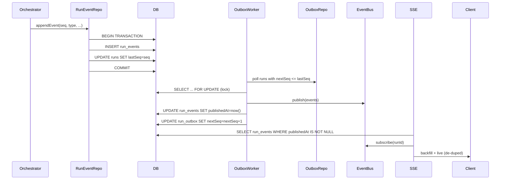

# M4 Remaining Work (Deferred to M5+)

## Status: ✅ Core Complete, 🔄 Polish Deferred

**Core M4 deliverables are COMPLETE and merged via PR #51:**
- ✅ Persistence layer (Prisma schema, repos, transactions)
- ✅ Outbox publisher (ordered, exactly-once publishing)
- ✅ SSE backfill (reconnect-safe with de-duplication)
- ✅ Testcontainers (deterministic test environment)
- ✅ Test helpers (awaitOutboxFlush, awaitStreamCompletion)
- ✅ CI integration (TEST_DATABASE_URL in workflows)
- ✅ Full test coverage (repos, outbox, backfill, e2e)

## Deferred Items (Originally M4 Scope)

### 1. Observability — Basic Metrics & Logging

**What:**
- Add counter increments for:
  - `runs_started` (when run created)
  - `runs_finished` (when RunFinished published)
  - `events_persisted` (on each RunEventRepo.appendEvent)
  - `events_published` (on each outbox publish)
- Add gauge for:
  - `outbox_lag_ms = now() - max(publishedAt)` per run
- Log hooks in:
  - RunEventRepo.appendEvent (seq, runId, type)
  - OutboxRepo.advanceSeq (runId, nextSeq)
  - Outbox worker publish loop (batch size, lag)

**Why Deferred:**
- Core persistence working; metrics are operational polish
- No production deployment yet, so monitoring not critical path
- Can add incrementally without schema changes

**Effort:** ~2-3 hours
**Priority:** Medium (needed before prod, not blocking M5)

### 2. Runbook — Troubleshooting Guide

**What:**
Create `docs/runbooks/m4-run-stuck.md` with:

**"Run Stuck" Checklist:**
1. Check `run_outbox.nextSeq` vs `runs.lastSeq` gap
2. Query `run_events WHERE runId=? AND seq=nextSeq` (missing row = append bug)
3. Check `publishedAt IS NULL` count (backlog indicator)
4. Inspect outbox worker logs for errors/crashes
5. Manual recovery: restart outbox worker (never write publishedAt by hand)

**"Rebuild Stream" Steps:**
1. Client reconnects with last received seq: `GET /stream?fromSeq=<last>`
2. Server backfills from `run_events WHERE publishedAt IS NOT NULL`
3. Verify events arrive in order (seq monotonic)
4. Watch for terminal event (server closes SSE)

**"High Reconnect Rate" Checklist:**
1. Check reverse proxy buffering settings (nginx: `X-Accel-Buffering: no`)
2. Verify heartbeat interval (currently 15s)
3. Inspect client logs for connection drops

**Why Deferred:**
- No production incidents yet to validate runbook scenarios
- Team can add based on real operational issues
- Not blocking M5 supertest migration

**Effort:** ~1 hour
**Priority:** Low-Medium (needed before prod)

### 3. Architecture Docs — Flow Diagram Update

**What:**
Update `docs/architecture/flow.md` to show M4 persistence:

**Why Deferred:**
- Flow diagram not blocking development
- M3 flow diagram still accurate for external API contracts
- Can update incrementally as M5+ changes land

**Effort:** ~1 hour
**Priority:** Low (documentation polish)

### 4. Package README — agents-run Usage Guide

**What:**
Create `packages/features/agents-run/README.md` with:
- **Overview:** What this package does (orchestration + persistence + SSE)
- **Architecture:** Diagram of repos → outbox → bus → SSE
- **Usage:** How to start a run, stream events, handle reconnects
- **Environment:** Required env vars (DATABASE_URL, event bus config)
- **Testing:** How to run tests (local + CI)
- **Troubleshooting:** Link to runbook

**Why Deferred:**
- Package is internal; team already familiar with it
- External docs (API) are up to date
- Not blocking M5 or new feature development

**Effort:** ~2 hours
**Priority:** Low (nice-to-have for onboarding)

## Decision Rationale

**Why defer these items:**
1. **Tight scope:** M4 goal was "make persistence work," not "productionize"
2. **Fast iteration:** Get PR merged quickly, unblock M5 supertest migration
3. **No prod deployment:** Metrics/runbooks can wait until we're closer to prod
4. **Documentation debt:** Acceptable short-term; team context is high

**When to address:**
- Metrics/logging: Before first production deployment or load testing
- Runbook: After first production incident or before launch
- Flow diagram: Before M6 (if major changes) or before external handoff
- Package README: Before new team members onboard or open-source

## Total Deferred Effort

- **Metrics:** 2-3 hours
- **Runbook:** 1 hour
- **Flow diagram:** 1 hour
- **README:** 2 hours
- **Total:** ~6-8 hours (can be spread across future PRs)

## Recommendation

✅ **Merge M4 as-is** — Core functionality complete, tests passing, CI green

🔄 **Create M6 ticket** for observability + docs polish (post-M5 supertest migration)

🎯 **Focus on M5** — Fix e2e flakiness with supertest (higher ROI for dev velocity)

---

**Updated:** 2025-10-17
**Status:** Logged and tracked
**Next Review:** After M5 merge

